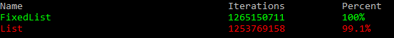
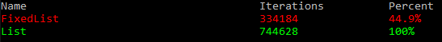
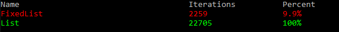
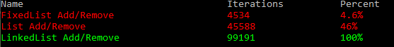
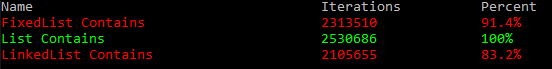

# FixedList
### A high performing Fixed List implementation

##### Adding and Removes single item 100 times, roughly the same as List<>

##### Adding 100 then Removing 100 items, 10 times, much faster

##### Adding 1000 then Removing 1000 items, 5 times, waaay faster

and some tests with LinkedList comparision

##### Adding 1000 then Removing 1000 items, 10 times, with linkedlist

##### Contains (string "500" in 1000 strings), 10 times, with linkedlist

this was achieved by trading a small amount of memory and convenience for performance
instead of shifting items around everytime you add or remove something the FixedList will keep track of empty spots in the array and automatically fill them in without looping over the whole list everytime, initial creation of a FixedList<> may be slower than List<> too.

## Implemented methods (most of these are self explanatory)
* ##### void Add(T item)
* ##### void RemoveAt(int index)
* ##### bool Remove(T item)
* ##### int RemoveAll(Func<T, bool> predicate)
* ##### int IndexOf(T item)
* ##### void Clear()
* ##### bool Contains(T item)
* ##### void CopyTo(ref T[] array, int arrayIndex)
* ##### void ForEach(Action<T> action)
* ##### T Find(Func<T, bool> predicate)
* ##### FixedList<T> Resize(int newCapacity)
